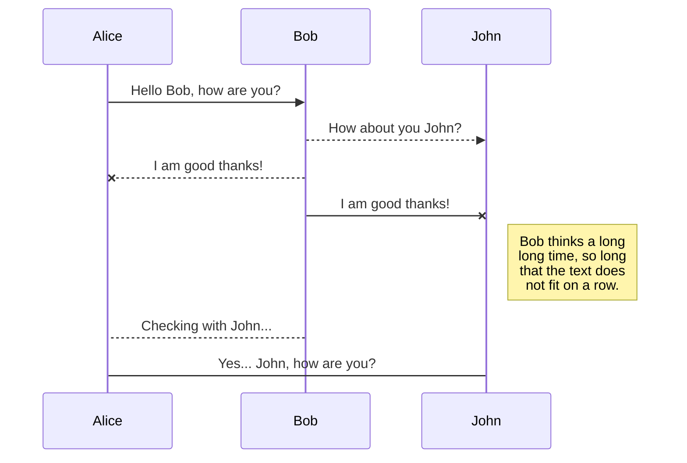
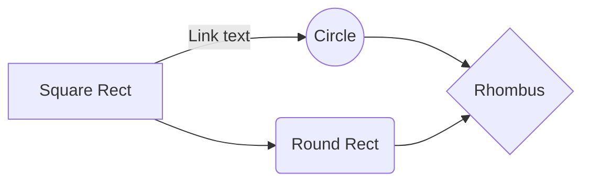

# Project Title

A brief description of what this project does and who it's for


## Acknowledgements

 - [Awesome Readme Templates](https://awesomeopensource.com/project/elangosundar/awesome-README-templates)
 - [Awesome README](https://github.com/matiassingers/awesome-readme)
 - [How to write a Good readme](https://bulldogjob.com/news/449-how-to-write-a-good-readme-for-your-github-project)


## Appendix

Any additional information goes here


## API Reference

#### Get all items

```http
  GET /api/items
```

| Parameter | Type     | Description                |
| :-------- | :------- | :------------------------- |
| `api_key` | `string` | **Required**. Your API key |

#### Get item

```http
  GET /api/items/${id}
```

| Parameter | Type     | Description                       |
| :-------- | :------- | :-------------------------------- |
| `id`      | `string` | **Required**. Id of item to fetch |

#### add(num1, num2)

Takes two numbers and returns the sum.


## Authors

- [@octokatherine](https://www.github.com/octokatherine)


## Badges

Add badges from somewhere like: [shields.io](https://shields.io/)

[](https://choosealicense.com/licenses/mit/)
[](https://opensource.org/licenses/)
[](http://www.gnu.org/licenses/agpl-3.0)

## Color Reference

| Color             | Hex                                                                |
| ----------------- | ------------------------------------------------------------------ |
| Example Color |  #0a192f |
| Example Color |  #f8f8f8 |
| Example Color |  #00b48a |
| Example Color |  #00d1a0 |


## Contributing

Contributions are always welcome!

See `contributing.md` for ways to get started.

Please adhere to this project's `code of conduct`.


## Demo

Insert gif or link to demo


## Deployment

To deploy this project run

```bash
  npm run deploy
```


## Documentation

[Documentation](https://linktodocumentation)


## Environment Variables

To run this project, you will need to add the following environment variables to your .env file

`API_KEY`

`ANOTHER_API_KEY`


## FAQ

#### Question 1

Answer 1

#### Question 2

Answer 2


## Features

- Light/dark mode toggle
- Live previews
- Fullscreen mode
- Cross platform


## Feedback

If you have any feedback, please reach out to us at fake@fake.com


## 🚀 About Me
I'm a full stack developer...


# Hi, I'm Katherine! 👋


## 🔗 Links
[](https://katherineoelsner.com/)
[](https://www.linkedin.com/)
[](https://twitter.com/)


## Other Common Github Profile Sections
👩‍💻 I'm currently working on...

🧠 I'm currently learning...

👯‍♀️ I'm looking to collaborate on...

🤔 I'm looking for help with...

💬 Ask me about...

📫 How to reach me...

😄 Pronouns...

⚡️ Fun fact...


## 🛠 Skills
Javascript, HTML, CSS...


## Installation

Install my-project with npm

```bash
  npm install my-project
  cd my-project
```
    
## Lessons Learned

What did you learn while building this project? What challenges did you face and how did you overcome them?


## License

[MIT](https://choosealicense.com/licenses/mit/)


## Optimizations

What optimizations did you make in your code? E.g. refactors, performance improvements, accessibility


## Related

Here are some related projects

[Awesome README](https://github.com/matiassingers/awesome-readme)


## Roadmap

- Additional browser support

- Add more integrations


## Run Locally

Clone the project

```bash
  git clone https://link-to-project
```

Go to the project directory

```bash
  cd my-project
```

Install dependencies

```bash
  npm install
```

Start the server

```bash
  npm run start
```


## Screenshots


## Support

For support, email fake@fake.com or join our Slack channel.


## Tech Stack

**Client:** React, Redux, TailwindCSS

**Server:** Node, Express


## Running Tests

To run tests, run the following command

```bash
  npm run test
```


## Usage/Examples

```javascript
import Component from 'my-project'

function App() {
  return <Component />
}
```


## Used By

This project is used by the following companies:

- Company 1
- Company 2

# Welcome to StackEdit!

Hi! I'm your first Markdown file in **StackEdit**. If you want to learn about StackEdit, you can read me. If you want to play with Markdown, you can edit me. Once you have finished with me, you can create new files by opening the **file explorer** on the left corner of the navigation bar.


# Files

StackEdit stores your files in your browser, which means all your files are automatically saved locally and are accessible **offline!**

## Create files and folders

The file explorer is accessible using the button in left corner of the navigation bar. You can create a new file by clicking the **New file** button in the file explorer. You can also create folders by clicking the **New folder** button.

## Switch to another file

All your files and folders are presented as a tree in the file explorer. You can switch from one to another by clicking a file in the tree.

## Rename a file

You can rename the current file by clicking the file name in the navigation bar or by clicking the **Rename** button in the file explorer.

## Delete a file

You can delete the current file by clicking the **Remove** button in the file explorer. The file will be moved into the **Trash** folder and automatically deleted after 7 days of inactivity.

## Export a file

You can export the current file by clicking **Export to disk** in the menu. You can choose to export the file as plain Markdown, as HTML using a Handlebars template or as a PDF.


# Synchronization

Synchronization is one of the biggest features of StackEdit. It enables you to synchronize any file in your workspace with other files stored in your **Google Drive**, your **Dropbox** and your **GitHub** accounts. This allows you to keep writing on other devices, collaborate with people you share the file with, integrate easily into your workflow... The synchronization mechanism takes place every minute in the background, downloading, merging, and uploading file modifications.

There are two types of synchronization and they can complement each other:

- The workspace synchronization will sync all your files, folders and settings automatically. This will allow you to fetch your workspace on any other device.
	> To start syncing your workspace, just sign in with Google in the menu.

- The file synchronization will keep one file of the workspace synced with one or multiple files in **Google Drive**, **Dropbox** or **GitHub**.
	> Before starting to sync files, you must link an account in the **Synchronize** sub-menu.

## Open a file

You can open a file from **Google Drive**, **Dropbox** or **GitHub** by opening the **Synchronize** sub-menu and clicking **Open from**. Once opened in the workspace, any modification in the file will be automatically synced.

## Save a file

You can save any file of the workspace to **Google Drive**, **Dropbox** or **GitHub** by opening the **Synchronize** sub-menu and clicking **Save on**. Even if a file in the workspace is already synced, you can save it to another location. StackEdit can sync one file with multiple locations and accounts.

## Synchronize a file

Once your file is linked to a synchronized location, StackEdit will periodically synchronize it by downloading/uploading any modification. A merge will be performed if necessary and conflicts will be resolved.

If you just have modified your file and you want to force syncing, click the **Synchronize now** button in the navigation bar.

> **Note:** The **Synchronize now** button is disabled if you have no file to synchronize.

## Manage file synchronization

Since one file can be synced with multiple locations, you can list and manage synchronized locations by clicking **File synchronization** in the **Synchronize** sub-menu. This allows you to list and remove synchronized locations that are linked to your file.


# Publication

Publishing in StackEdit makes it simple for you to publish online your files. Once you're happy with a file, you can publish it to different hosting platforms like **Blogger**, **Dropbox**, **Gist**, **GitHub**, **Google Drive**, **WordPress** and **Zendesk**. With [Handlebars templates](http://handlebarsjs.com/), you have full control over what you export.

> Before starting to publish, you must link an account in the **Publish** sub-menu.

## Publish a File

You can publish your file by opening the **Publish** sub-menu and by clicking **Publish to**. For some locations, you can choose between the following formats:

- Markdown: publish the Markdown text on a website that can interpret it (**GitHub** for instance),
- HTML: publish the file converted to HTML via a Handlebars template (on a blog for example).

## Update a publication

After publishing, StackEdit keeps your file linked to that publication which makes it easy for you to re-publish it. Once you have modified your file and you want to update your publication, click on the **Publish now** button in the navigation bar.

> **Note:** The **Publish now** button is disabled if your file has not been published yet.

## Manage file publication

Since one file can be published to multiple locations, you can list and manage publish locations by clicking **File publication** in the **Publish** sub-menu. This allows you to list and remove publication locations that are linked to your file.


# Markdown extensions

StackEdit extends the standard Markdown syntax by adding extra **Markdown extensions**, providing you with some nice features.

> **ProTip:** You can disable any **Markdown extension** in the **File properties** dialog.


## SmartyPants

SmartyPants converts ASCII punctuation characters into "smart" typographic punctuation HTML entities. For example:

|                |ASCII                          |HTML                         |
|----------------|-------------------------------|-----------------------------|
|Single backticks|`'Isn't this fun?'`            |'Isn't this fun?'            |
|Quotes          |`"Isn't this fun?"`            |"Isn't this fun?"            |
|Dashes          |`-- is en-dash, --- is em-dash`|-- is en-dash, --- is em-dash|


## KaTeX

You can render LaTeX mathematical expressions using [KaTeX](https://khan.github.io/KaTeX/):

The *Gamma function* satisfying $\Gamma(n) = (n-1)!\quad\forall n\in\mathbb N$ is via the Euler integral

$$
\Gamma(z) = \int_0^\infty t^{z-1}e^{-t}dt\,.
$$

> You can find more information about **LaTeX** mathematical expressions [here](http://meta.math.stackexchange.com/questions/5020/mathjax-basic-tutorial-and-quick-reference).


## UML diagrams

You can render UML diagrams using [Mermaid](https://mermaidjs.github.io/). For example, this will produce a sequence diagram:



And this will produce a flow chart:



# Dillinger
## _The Last Markdown Editor, Ever_

[](https://nodesource.com/products/nsolid)

[](https://travis-ci.org/joemccann/dillinger)

Dillinger is a cloud-enabled, mobile-ready, offline-storage compatible,
AngularJS-powered HTML5 Markdown editor.

- Type some Markdown on the left
- See HTML in the right
- ✨Magic ✨

## Features

- Import a HTML file and watch it magically convert to Markdown
- Drag and drop images (requires your Dropbox account be linked)
- Import and save files from GitHub, Dropbox, Google Drive and One Drive
- Drag and drop markdown and HTML files into Dillinger
- Export documents as Markdown, HTML and PDF

Markdown is a lightweight markup language based on the formatting conventions
that people naturally use in email.
As [John Gruber] writes on the [Markdown site][df1]

> The overriding design goal for Markdown's
> formatting syntax is to make it as readable
> as possible. The idea is that a
> Markdown-formatted document should be
> publishable as-is, as plain text, without
> looking like it's been marked up with tags
> or formatting instructions.

This text you see here is *actually- written in Markdown! To get a feel
for Markdown's syntax, type some text into the left window and
watch the results in the right.

## Tech

Dillinger uses a number of open source projects to work properly:

- [AngularJS] - HTML enhanced for web apps!
- [Ace Editor] - awesome web-based text editor
- [markdown-it] - Markdown parser done right. Fast and easy to extend.
- [Twitter Bootstrap] - great UI boilerplate for modern web apps
- [node.js] - evented I/O for the backend
- [Express] - fast node.js network app framework [@tjholowaychuk]
- [Gulp] - the streaming build system
- [Breakdance](https://breakdance.github.io/breakdance/) - HTML
to Markdown converter
- [jQuery] - duh

And of course Dillinger itself is open source with a [public repository][dill]
 on GitHub.

## Installation

Dillinger requires [Node.js](https://nodejs.org/) v10+ to run.

Install the dependencies and devDependencies and start the server.

```sh
cd dillinger
npm i
node app
```

For production environments...

```sh
npm install --production
NODE_ENV=production node app
```

## Plugins

Dillinger is currently extended with the following plugins.
Instructions on how to use them in your own application are linked below.

| Plugin | README |
| ------ | ------ |
| Dropbox | [plugins/dropbox/README.md][PlDb] |
| GitHub | [plugins/github/README.md][PlGh] |
| Google Drive | [plugins/googledrive/README.md][PlGd] |
| OneDrive | [plugins/onedrive/README.md][PlOd] |
| Medium | [plugins/medium/README.md][PlMe] |
| Google Analytics | [plugins/googleanalytics/README.md][PlGa] |

## Development

Want to contribute? Great!

Dillinger uses Gulp + Webpack for fast developing.
Make a change in your file and instantaneously see your updates!

Open your favorite Terminal and run these commands.

First Tab:

```sh
node app
```

Second Tab:

```sh
gulp watch
```

(optional) Third:

```sh
karma test
```

#### Building for source

For production release:

```sh
gulp build --prod
```

Generating pre-built zip archives for distribution:

```sh
gulp build dist --prod
```

## Docker

Dillinger is very easy to install and deploy in a Docker container.

By default, the Docker will expose port 8080, so change this within the
Dockerfile if necessary. When ready, simply use the Dockerfile to
build the image.

```sh
cd dillinger
docker build -t <youruser>/dillinger:${package.json.version} .
```

This will create the dillinger image and pull in the necessary dependencies.
Be sure to swap out `${package.json.version}` with the actual
version of Dillinger.

Once done, run the Docker image and map the port to whatever you wish on
your host. In this example, we simply map port 8000 of the host to
port 8080 of the Docker (or whatever port was exposed in the Dockerfile):

```sh
docker run -d -p 8000:8080 --restart=always --cap-add=SYS_ADMIN --name=dillinger <youruser>/dillinger:${package.json.version}
```

> Note: `--capt-add=SYS-ADMIN` is required for PDF rendering.

Verify the deployment by navigating to your server address in
your preferred browser.

```sh
127.0.0.1:8000
```

## License

MIT

**Free Software, Hell Yeah!**

[//]: # (These are reference links used in the body of this note and get stripped out when the markdown processor does its job. There is no need to format nicely because it shouldn't be seen. Thanks SO - http://stackoverflow.com/questions/4823468/store-comments-in-markdown-syntax)

   [dill]: <https://github.com/joemccann/dillinger>
   [git-repo-url]: <https://github.com/joemccann/dillinger.git>
   [john gruber]: <http://daringfireball.net>
   [df1]: <http://daringfireball.net/projects/markdown/>
   [markdown-it]: <https://github.com/markdown-it/markdown-it>
   [Ace Editor]: <http://ace.ajax.org>
   [node.js]: <http://nodejs.org>
   [Twitter Bootstrap]: <http://twitter.github.com/bootstrap/>
   [jQuery]: <http://jquery.com>
   [@tjholowaychuk]: <http://twitter.com/tjholowaychuk>
   [express]: <http://expressjs.com>
   [AngularJS]: <http://angularjs.org>
   [Gulp]: <http://gulpjs.com>

   [PlDb]: <https://github.com/joemccann/dillinger/tree/master/plugins/dropbox/README.md>
   [PlGh]: <https://github.com/joemccann/dillinger/tree/master/plugins/github/README.md>
   [PlGd]: <https://github.com/joemccann/dillinger/tree/master/plugins/googledrive/README.md>
   [PlOd]: <https://github.com/joemccann/dillinger/tree/master/plugins/onedrive/README.md>
   [PlMe]: <https://github.com/joemccann/dillinger/tree/master/plugins/medium/README.md>
   [PlGa]: <https://github.com/RahulHP/dillinger/blob/master/plugins/googleanalytics/README.md>


# Welcome to [Vrite](https://vrite.io)!


Vrite is an [open-source](https://github.com/vriteio/vrite), collaborative, **developer content platform** for creating, managing, and deploying product documentation, knowledge bases, and technical blogs.

With an extensible, collaborative editor, content management dashboard, and built-in features like semantic search, GitHub sync, and more — all accessible via [powerful API](https://docs.vrite.io/api/authentication) — Vrite aims to provide an all-in-one experience for creating, managing, and publishing all kinds of technical content.

## Get to Know Vrite editor

> Most options can be enabled/disabled in the settings (_Settings → Editor_) to tailor your experience.

1. Various formatting options

- **Bold** — `**markdown**` — `Ctrl B`/`⌘B`;
- _Italic_ — `*markdown*` — `Ctrl I`/`⌘I`;
- ~~Strikethrough~~ — `~~markdown~~` — `Ctrl Shift X`/`⌘ Shift X`;
- `Inline code` — `markdown` — `Ctrl E`/`⌘E`;
- Highlight — `==markdown==` — `Ctrl Shift H`/`⌘ Shift H`;
- Underline — `Ctrl U`/`⌘U`;
- Superscript — `Ctrl ,`/`⌘,`;
- Subscript — `Ctrl .`/`⌘.`;
- [Link](https://vrite.io/) — `[markdown](link)` — you can also `Ctrl V`/`⌘V` the URL to link the selected text fragment;

  > **Tip**: Move you **inside a link** to see its preview!

- Integrated [Monaco Editor](https://microsoft.github.io/monaco-editor/) and [Prettier](https://prettier.io/) for code blocks:

```javascript
const sayHello = () => {
  console.log("Hello World!");
};

sayHello();
```

3. Tables

| Header 1 | Header 2 | Header 3 |
| -------- | -------- | -------- |
| Cell 1A  | Cell 1B  | Cell 1C  |
| Cell 2A  | Cell 2B  | Cell 2C  |
| Cell 3A  | Cell 3B  | Cell 3C  |

3. Images

 4. Custom elements

Hello World from inside the `element`. 5. Other features

- Built-in, interactive embeds ([CodePen](https://assets.vrite.io/65017ed7b0e627e259623b8a/-R7ZANANzebSVDyqVtB_K.png), [CodeSandbox](https://codesandbox.io/), YouTube)
- Zen mode (in the toolbar, top-right corner);
- MDX, MD, HTML, and JSON exports (easy to copy-paste);
- Stats (in the bottom menu, bottom-right corner)
- Real-time collaboration & commenting (select some text to add a comment)
- …

Full usage guide here: [https://docs.vrite.io/content-editor](https://docs.vrite.io/content-editor)

## Content Management in Vrite

Vrite provides multiple ways for you to manage your content.

### Vrite dashboard

The [dashboard](https://app.vrite.io/) is focused solely on content management. Here you can organize your content and edit metadata using one of two views:

1. **Kanban** — great for working in teams and managing complex content production process

 2. **Table** — optimized for viewing all kinds of metadata at a glance


### Explorer

Aside from the dashboard, Vrite provides an **Explorer** panel, easily accessible on the right of both the dashboard and the editor.

Explorer is your go-to when writing/managing “nested” content like **documentation**. Select a content group to view its contents in the dashboard or a content piece to open it immediately in the editor.


## Many Other Features

Check out the following resources to learn more:

- 🌟 **Star Vrite on GitHub** — [https://github.com/vriteio/vrite](https://github.com/vriteio/vrite)
- 🐞 **Report bugs** — [https://github.com/vriteio/vrite/issues](https://github.com/vriteio/vrite/issues)
- 🐦 **Follow on Twitter** — [https://twitter.com/vriteio](https://twitter.com/vriteio)
- 💬 **Join Vrite Discord** — [https://discord.gg/yYqDWyKnqE](https://discord.gg/yYqDWyKnqE)
- ℹ️ **Learn more about Vrite** — [https://vrite.io](https://vrite.io)
- 📕 **Vrite documentation** — [https://docs.vrite.io](https://docs.vrite.io)

  GDFG

- [ ] GHFH
- [ ] HFH

---


<h1>Welcome to <a href="https://vrite.io">Vrite</a>!</h1>

<p>
  Vrite is an <a href="https://github.com/vriteio/vrite">open-source</a>,
  collaborative, <strong>developer content platform</strong> for creating,
  managing, and deploying product documentation, knowledge bases, and technical
  blogs.
</p>
<p>
  With an extensible, collaborative editor, content management dashboard, and
  built-in features like semantic search, GitHub sync, and more — all accessible
  via <a href="https://docs.vrite.io/api/authentication">powerful API</a> —
  Vrite aims to provide an all-in-one experience for creating, managing, and
  publishing all kinds of technical content.
</p>
<h2>Get to Know Vrite editor</h2>
<blockquote>
  <p>
    Most options can be enabled/disabled in the settings (<em
      >Settings → Editor</em
    >) to tailor your experience.
  </p>
</blockquote>
<ol start="1">
  <li><p>Various formatting options</p></li>
</ol>
<ul>
  <li>
    <p>
      <strong>Bold</strong> — <code>**markdown**</code> —
      <code>Ctrl B</code>/<code>⌘B</code>;
    </p>
  </li>
  <li>
    <p>
      <em>Italic</em> — <code>*markdown*</code> —
      <code>Ctrl I</code>/<code>⌘I</code>;
    </p>
  </li>
  <li>
    <p>
      <s>Strikethrough</s> — <code>~~markdown~~</code> —
      <code>Ctrl Shift X</code>/<code>⌘ Shift X</code>;
    </p>
  </li>
  <li>
    <p>
      <code>Inline code</code> — <code>markdown</code> —
      <code>Ctrl E</code>/<code>⌘E</code>;
    </p>
  </li>
  <li>
    <p>
      <mark>Highlight</mark> — <code>==markdown==</code> —
      <code>Ctrl Shift H</code>/<code>⌘ Shift H</code>;
    </p>
  </li>
  <li>
    <p>Underline — <code>Ctrl U</code>/<code>⌘U</code>;</p>
  </li>
  <li>
    <p><sub>Superscript</sub> — <code>Ctrl ,</code>/<code>⌘,</code>;</p>
  </li>
  <li>
    <p><sup>Subscript</sup> — <code>Ctrl .</code>/<code>⌘.</code>;</p>
  </li>
  <li>
    <p>
      <a href="https://vrite.io/">Link</a> — <code>[markdown](link)</code> — you
      can also <code>Ctrl V</code>/<code>⌘V</code> the URL to link the selected
      text fragment;
    </p>
    <blockquote>
      <p>
        <strong>Tip</strong>: Move you <strong>inside a link</strong> to see its
        preview!
      </p>
    </blockquote>
  </li>
  <li>
    <p>
      Integrated
      <a href="https://microsoft.github.io/monaco-editor/">Monaco Editor</a> and
      <a href="https://prettier.io/">Prettier</a> for code blocks:
    </p>
  </li>
</ul>
<pre lang="javascript"><code>const sayHello = () =&gt; {
  console.log(&quot;Hello World!&quot;);
};

sayHello();</code></pre>
<ol start="3">
  <li><p>Tables</p></li>
</ol>
<table>
  <tr>
    <th><p>Header 1</p></th>
    <th><p>Header 2</p></th>
    <th><p>Header 3</p></th>
  </tr>
  <tr>
    <td><p>Cell 1A</p></td>
    <td><p>Cell 1B</p></td>
    <td><p>Cell 1C</p></td>
  </tr>
  <tr>
    <td><p>Cell 2A</p></td>
    <td><p>Cell 2B</p></td>
    <td><p>Cell 2C</p></td>
  </tr>
  <tr>
    <td><p>Cell 3A</p></td>
    <td><p>Cell 3B</p></td>
    <td><p>Cell 3C</p></td>
  </tr>
</table>
<ol start="3">
  <li><p>Images</p></li>
</ol>

<ol start="4">
  <li><p>Custom elements</p></li>
</ol>
<div data-type="Element" data-props='{"myProp":1}'>
  <p>Hello World from inside the <code>element</code>.</p>
</div>
<ol start="5">
  <li><p>Other features</p></li>
</ol>
<ul>
  <li>
    <p>
      Built-in, interactive embeds (<a
        href="https://assets.vrite.io/65017ed7b0e627e259623b8a/-R7ZANANzebSVDyqVtB_K.png"
        >CodePen</a
      >, <a href="https://codesandbox.io/">CodeSandbox</a>, YouTube)
    </p>
  </li>
  <li><p>Zen mode (in the toolbar, top-right corner);</p></li>
  <li><p>MDX, MD, HTML, and JSON exports (easy to copy-paste);</p></li>
  <li><p>Stats (in the bottom menu, bottom-right corner)</p></li>
  <li>
    <p>
      Real-time collaboration & commenting (select some text to add a comment)
    </p>
  </li>
  <li><p>…</p></li>
</ul>
<p>
  Full usage guide here:
  <a href="https://docs.vrite.io/content-editor"
    >https://docs.vrite.io/content-editor</a
  >
</p>
<h2>Content Management in Vrite</h2>
<p>Vrite provides multiple ways for you to manage your content.</p>
<h3>Vrite dashboard</h3>
<p>
  The <a href="https://app.vrite.io/">dashboard</a> is focused solely on content
  management. Here you can organize your content and edit metadata using one of
  two views:
</p>
<ol start="1">
  <li>
    <p>
      <strong>Kanban</strong> — great for working in teams and managing complex
      content production process
    </p>
  </li>
</ol>

<ol start="2">
  <li>
    <p>
      <strong>Table</strong> — optimized for viewing all kinds of metadata at a
      glance
    </p>
  </li>
</ol>

<h3>Explorer</h3>
<p>
  Aside from the dashboard, Vrite provides an <strong>Explorer</strong> panel,
  easily accessible on the right of both the dashboard and the editor.
</p>
<p>
  Explorer is your go-to when writing/managing “nested” content like
  <strong>documentation</strong>. Select a content group to view its contents in
  the dashboard or a content piece to open it immediately in the editor.
</p>

<h2>Many Other Features</h2>
<p>Check out the following resources to learn more:</p>
<ul>
  <li>
    <p>
      🌟 <strong>Star Vrite on GitHub</strong> —
      <a href="https://github.com/vriteio/vrite"
        >https://github.com/vriteio/vrite</a
      >
    </p>
  </li>
  <li>
    <p>
      🐞 <strong>Report bugs</strong> —
      <a href="https://github.com/vriteio/vrite/issues"
        >https://github.com/vriteio/vrite/issues</a
      >
    </p>
  </li>
  <li>
    <p>
      🐦 <strong>Follow on Twitter</strong> —
      <a href="https://twitter.com/vriteio">https://twitter.com/vriteio</a>
    </p>
  </li>
  <li>
    <p>
      💬 <strong>Join Vrite Discord</strong> —
      <a href="https://discord.gg/yYqDWyKnqE">https://discord.gg/yYqDWyKnqE</a>
    </p>
  </li>
  <li>
    <p>
      ℹ️ <strong>Learn more about Vrite</strong> —
      <a href="https://vrite.io">https://vrite.io</a>
    </p>
  </li>
  <li>
    <p>
      📕 <strong>Vrite documentation</strong> —
      <a href="https://docs.vrite.io">https://docs.vrite.io</a>
    </p>
  </li>
</ul>
<p></p>
