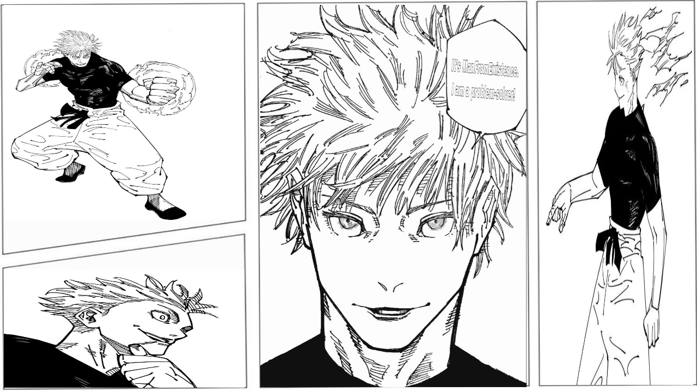

# manfromexistence 👋
<div align="center">
  
</div>

<!-- ```
git add . && git commit -m "feat: this is an automated commit made by manfromexitence from manfromexsitence02 account" && git push
git add . && git commit -m "feat: this is an automated commit made by manfromexitence from manfromexsitence04 account" && git push
# Things that I need to do ASAP

- Do this Github Profile
I have to update my logo
- Have to update the current multiverse logo
``` -->

<!-- ```
bunx create-next-app@rc --turbo
ls -l | grep -v "^\." | grep "^d" | wc -l
npm install -g npm@10.8.3 && npm install -g bun
bun install && bun run dev
bun pm trust --all 
rm -rf .contentlayer .next node_modules
git add . && git commit -m "feat: automated commit by manfromexistence" && git push
```

## Nextjs15 and Tailwind4.3
```
{
  "name": "www",
  "version": "0.0.1",
  "private": true,
  "scripts": {
    "dev": "next dev --turbo",
    "build": "next build",
    "start": "next start",
    "lint": "next lint"
  },
  "dependencies": {
    "@tailwindcss/postcss": "^4.0.0-alpha.15",
    "tailwindcss": "4.0.0-alpha.3",
    "next": "15.0.0-rc.0",
    "react": "19.0.0-rc-f994737d14-20240522",
    "react-dom": "19.0.0-rc-f994737d14-20240522"
  },
  "devDependencies": {
    "typescript": "^5",
    "@types/node": "^20",
    "@types/react": "^18",
    "@types/react-dom": "^18",
    "eslint": "^8",
    "eslint-config-next": "15.0.0-rc.0"
  }
}
``` -->

<div align="center">
  
</div>

<pre align="center">
      💼 No job @ POOR • Full-stack dev • All Platforms Engineer
      💻 Ai • Blockchain
      📖 Currently doing my own projects
      🎮 Music • Games • Anime • Code • Art
      🐾 Love all animals 🐰 • Love Cakes 🐤🐥
</pre>

<div align="center">
  
</div>

# More about me 💬

### - I'm a 19-year-old Programmer plus a Machine Learning & Artificial Intelligence Enthusiast.


### - Learning :

- ✨ Data Structures & Algorithms
- ✨ Generative Adversarial Networks

### - Hobbies :

- ✨ Watching Anime
- ✨ Reading Light Novels
- ✨ Football
</br>

---

# Languages & Tools 👨‍💻

<p align="center">
  
  
  
  
  
  </br>
  
  
  </br>
  
  
  
</p>

```
🌞 Morning   6 commits    █████░░░░░░░░░░░░░░░░  24.2%
🌆 Daytime   5 commits    ███░░░░░░░░░░░░░░░░░░  14.5%
🌃 Evening   3 commits    ██████▎░░░░░░░░░░░░░░  29.9%
🌙 Night infinity commits ██████▌░░░░░░░░░░░░░░  31.4%
```


### If you are already not having then I am hoping for your:

<div align="center">
	<br>
		
	<br>
</div>

### This is --> manfromexistence(Peace out + HACKING/SIGNING OUT + Sayonara)

<div align="center">
	
</div>
